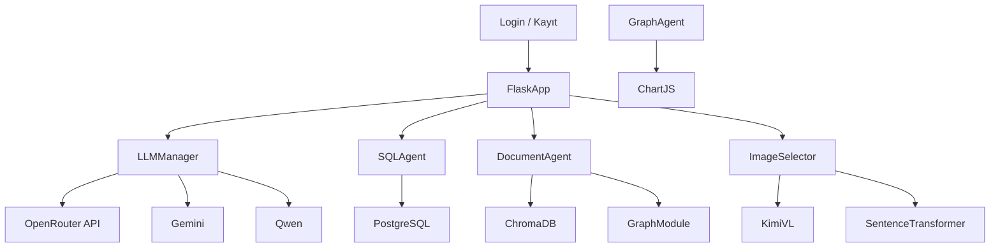

# 🤖 GADGETAI - LangChain, Docker, Kubernetes ile Belgelesen İnsan Kaynakları Otomasyonu

İnsan Kaynakları süreçlerini yapay zekâ ile otomatikleştiren bu sistem, doğal dil işleme (LLM), belge tabanlı arama (RAG), görsel analiz ve SQL destekli veri erişimi gibi teknolojileri bir araya getiren Flask tabanlı, modüler bir mimariye sahiptir.

---

## Proje Özeti

Bu proje, modern yapay zekâ bileşenlerini LangChain çatısı altında birleştirerek geliştirilmiştir. Sistem, kullanıcıların teknik bilgi gerektirmeden verilerle etkileşim kurabilmesini sağlayan iki ana akıllı modülden oluşur:

### SQL Asistanı
- Kullanıcının doğal dilde verdiği sorgular LangChain aracılığıyla analiz edilir ve ilgili işlem için uygun Tool fonksiyonu tetiklenir.
- Bu sistem doğrudan SQL kodu üretmez; güvenli, önceden tanımlanmış işlevler üzerinden çalışır.
- Kullanıcının herhangi bir teknik bilgiye ya da kod yazmaya ihtiyacı yoktur.
- Tüm veritabanı işlemleri, LangChain tool yapısına gömülü olarak gerçekleştiği için dış müdahalelere ve hatalı sorgulara karşı izole bir ortam sağlanır.
- Veritabanı yapısı PostgreSQL üzerinde kuruludur ve yalnızca tanımlı yetkilere sahip kullanıcılar işlem gerçekleştirebilir.

### 📄 Döküman Asistanı
- Kullanıcı tarafından yüklenen PDF ve Word belgeleri sistem tarafından işlenir; metin içerikleri çıkarılarak ChromaDB üzerinde vektörlenmiş biçimde saklanır.
- Belge içerisinde görsel varsa, bu görsellerdeki metinler Tesseract OCR aracılığıyla okunur ve belge içeriğiyle ilişkilendirilir.
- Ardından, KimiVL destekli görsel açıklama sistemi devreye girerek her görselin anlamı çıkarılır; kullanıcıdan gelen prompt'a en uygun görsel eşleştirilir.
- Sayısal veri içeren belgelerde, içerik otomatik olarak analiz edilerek Chart.js uyumlu grafik verisi oluşturulur ve frontend'e hazır hâlde sunulur.
- Tüm bu yapı, belgelerle doğal dil üzerinden anlamlı, görsel destekli etkileşim kurulmasını sağlar.

---

## 🚀 Özellikler

- 🔐 **JWT Tabanlı Giriş ve Rol Yönetimi**
    Kullanıcıların kimlik doğrulaması ve yetki seviyeleri (admin/kullanıcı) token bazlı olarak kontrol edilir.
- 💬 **Doğal Dil ile Veritabanı Sorgulama (LangChain Agent)**
    SQL yazmadan, ön tanımlı tool fonksiyonları aracılığıyla doğal dil komutlarıyla işlem yapılabilir.
- 📄 **Belge Odaklı Arama Sistemi (OCR + RAG Destekli)**
    PDF/Word belgelerden metin ve görsel içerik çıkarılır, ChromaDB’ye kaydedilerek vektörel arama yapılır.
- 🧠 **Model Yönetim Altyapısı (OpenRouter, Gemini, Qwen)**
    LLM’ler, OpenRouter API’si üzerinden seçilebilir şekilde entegre edilir.
- 📈 **Otomatik Grafik Üretimi (Chart.js ile Uyumlu)**
    Belge içeriğindeki sayısal veriler analiz edilerek otomatik grafik çizimi için JSON formatında çıktı üretilir.
- 🖼️ **Görsel Açıklama ve Eşleştirme (KimiVL + SentenceTransformer)**
    Görseller, LLM destekli olarak anlamlandırılır ve kullanıcının sorgusuna en uygun görseller seçilir.

---

## 🧱 Sistem Mimarisi



---

## 🧰 Kullanılan Teknolojiler

| Bileşen | Açıklama |
|--------|----------|
| **Flask** | Uygulamanın backend tarafında REST API’leri ve yönlendirmeleri sağlayan mikro web çatısı. |
| **LangChain** | LLM odaklı uygulama geliştirmek için kullanılan framework; agent, memory ve tool yapıları burada entegre edildi. |
| **ChromaDB** | Vektörel belge arama için kullanılan açık kaynaklı vektör veritabanı; RAG (Retrieval-Augmented Generation) sisteminin temelidir. |
| **Tesseract OCR** | Belgelerdeki görsellerden metin çıkarımı için kullanılan açık kaynaklı OCR motoru. |
| **KimiVL** | Görsellerin anlamlandırılması için kullanılan görsel LLM (OpenRouter üzerinden erişilen multimodal model). |
| **SentenceTransformer** | Görsel açıklama ve kullanıcı prompt’ları arasında benzerlik karşılaştırması için kullanılan embedding modeli. |
| **Chart.js** | 	Belgelerden çıkarılan sayısal verilerin görselleştirilmesini sağlayan JavaScript tabanlı frontend grafik kütüphanesi. |
| **PostgreSQL** | Sistem içindeki SQL sorgularının çalıştığı, kullanıcı ve çalışan verilerinin saklandığı ilişkisel veritabanı. |

---

## 🔧 Kurulum

```bash
git clone https://github.com/cankumet/GadgetAI-HR-Assistant-.git
cd GadgetAI-HR-Assistant-
python -m venv venv
Windows: venv\Scripts\activate
pip install -r requirements.txt
```

`.env` dosyanızı oluşturun:

```ini
OPENROUTER_API_KEY=your_api_key
OPENROUTER_API_BASE=https://openrouter.ai/api/v1
DB_HOST=localhost
DB_NAME=hr_db
DB_USERNAME=postgres
DB_PASSWORD=yourpassword
```

Docker kurulumları için proje kök dizinindeki Dockerfile dosyası, CI/CD süreçlerine uygun şekilde otomatikleştirilmiş olarak yapılandırılmıştır.
Eğer sistem ilk kez kurulacaksa, firstDockerInstallation/ klasörü içerisindeki özel Dockerfile yapısı kullanılmalıdır. Bu yapı, temel bağımlılıkların sıfırdan kurulması ve ortamın ilk defa ayağa kaldırılması için optimize edilmiştir.

---

---

## 📁 Dosya Yapısı

```bash
├── app.py                  # Flask uygulaması giriş
├── main.py                 # Ana başlatıcı
├── llm_manager.py          # Model yöneticisi
├── agent.py                # Agent yöneticisi
├── read_rag.py             # RAG sistemi
├── graph_agent.py          # Grafik destekli analiz
├── image_selector.py       # Görsel analiz
├── user_database.py        # Kullanıcı yönetimi
├── auth_database.py        # Rol erişim yönetimi
├── templates/              # HTML sayfaları
└── static/images/          # İşlenen görseller
```
---

## ⚙️ YAML Konfigürasyonları

### 📦 1. Dockerfile
- Base image: `python:3.11-slim`
- Sistem bağımlılıkları: `libgl1-mesa-glx, libglib2.0-0 (OpenCV ve görsel işleme kütüphaneleri için)`
- Kullanıcı: `root`
- Çalışma dizini: `/app`
- Gerekli dosyalar: `requirements.txt ve tüm proje dosyaları`
- Bağımlılık kurulumu: `pip install --no-cache-dir -r requirements.txt`
- Uygulama giriş komutu: `CMD ["python", "main.py"]`

---

### ☸️ 2. flask-deployment.yaml
- **Kind**: `Deployment`
- Namespace: `argocd`
- Uygulama adı: `flask-app`
- Replica: `1`
- Container adı: `flask-container`
- Image: `cankumet/flask-agent:patchedv38`
- Açık port: `5000`
- Ortam değişkenleri:
  - `DB_HOST=postgres-service`
  - `DB_PORT=5432`
  - `DB_NAME=HR`
  - `DB_USERNAME=postgres`
  - `DB_PASSWORD=123456`

---

### 🌐 3. flask-service.yaml
- **Kind**: `Service`
- Servis adı: `flask-service`
- Tip: `NodePort`
- Selector: `app: flask-app`
- Port yönlendirmeleri:
  - `protocol: TCP`
  - `port: 5000`
  - `targetPort: 5000`
  - `nodePort: 30001`

---

### 🛢️ 4. postgres-deployment.yaml
- **Kind**: `Deployment`
- Uygulama adı: `postgres`
- Replica: `1`
- Image: `postgres:14`
- Açık port: `5432`
- Ortam değişkenleri:
  - `POSTGRES_DB=HR`
  - `POSTGRES_USER=postgres`
  - `POSTGRES_PASSWORD=123456`
- Volume:
  - Mount path: `/var/lib/postgresql/data`
  - PVC: `postgres-pvc (volume adı: postgres-storage)`

---

### 💾 5. postgres-pvc.yaml
- **Kind**: `PersistentVolumeClaim`
- PVC adı: `postgres-pvc`
- Erişim modu: `ReadWriteOnce`
- Depolama isteği: `1Gi`

---

### 🌐 6. postgres-service.yaml
- **Kind**: `Service`
- Servis adı: `postgres-service`
- Selector: `app: postgres`
- Port yönlendirmeleri:
  - `protocol: TCP`
  - `port: 5432`
  - `targetPort: 5432`

---

### 🔄 7. auto-patch.yaml (GitHub Actions Workflow)

- **Amaç**: master branch'e yapılan her push işleminden sonra, mevcut Docker image versiyonlarını kontrol ederek otomatik olarak yeni bir image oluşturmak ve bunu flask-deployment.yaml dosyasına entegre edip ArgoCD ile Kubernetes'e yansıtmak.

---

#### 📌 Trigger
- Yalnızca master branch'e yapılan push işlemlerinde çalışır.
- `k8s/flask-deployment.yaml` dosyasındaki değişiklikler bu işlemden hariç tutulur (paths-ignore ile).

---

#### 🌍 Ortam Değişkenleri (env)
- `IMAGE_NAME:  flask-agent` →  Oluşturulacak Docker imajının adı.
- `DOCKER_REPO: cankumet` → DockerHub kullanıcı adı.

---

#### 🧪 Job: patch

**Ortam**: `ubuntu-latest`

**Adımlar:**
1. **Kodları Al**
   `actions/checkout@v3` ile GitHub Actions deposundaki kaynak kod çekilir.

2. **DockerHub'a Giriş Yap**  
   `docker/login-action@v2` ile DockerHub’a secrets üzerinden giriş yapılır.

3. **Mevcut Image Versiyonunu Bul**
    DockerHub üzerindeki patchedvX tag’leri taranır.
      - Tag yoksa `patchedv1` ile başlanır.
      - Varsa, en son tag’e göre `patchedvX+1` oluşturulur.

4. **Dockerfile için BASE_TAG Ayarla**
    En güncel versiyona göre `BASE_TAG` belirlenir. Bu tag build arg olarak kullanılır.

5. **Yeni Image Oluştur ve Push Et**
    `docker build` komutu ile yeni image oluşturulur ve `docker push` ile DockerHub’a yüklenir.

6. **Deployment YAML Güncelle**
    `k8s/flask-deployment.yaml` dosyasındaki image tag güncellenir.

7. **Güncellenmiş Dosyayı Commit Et ve Pushla**
    Güncellenmiş deployment YAML dosyası otomatik olarak commit edilir ve `master` branch'e push edilir.

> Bu yapı sayesinde image versiyonlama ve dağıtım süreci tamamen otomatikleştirilmiştir. CI/CD sistemine entegre çalışarak, güncellemelerin Kubernetes ortamına otomatik olarak yansımasını sağlar.


## 🧑‍💻 Geliştirici
**Fahri Can KÜMET [@cankumet](https://github.com/cankumet)**

